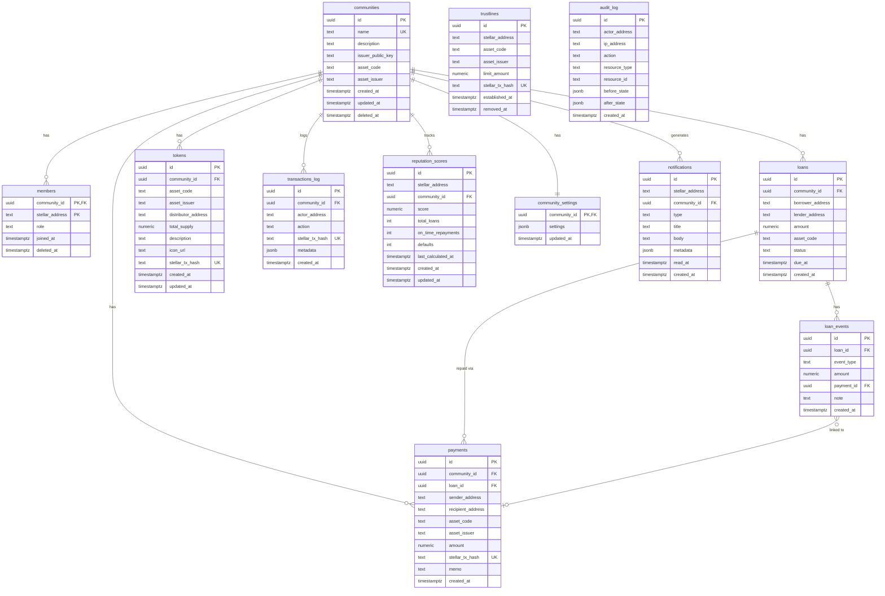

# Database Schema

PostgreSQL 16. All timestamps are `TIMESTAMPTZ` (UTC). UUIDs use `gen_random_uuid()`.

---

## ERD

---

## Tables

### `schema_migrations`

Migration tracking table. Applied automatically by the runner before any other migrations.

| Column       | Type          | Notes                   |
| ------------ | ------------- | ----------------------- |
| `name`       | `TEXT`        | PK — migration filename |
| `applied_at` | `TIMESTAMPTZ` | When the migration ran  |

---

### `communities`

A registered cooperative community on CoopLumen. Each community maps to a Stellar custom asset.

| Column              | Type          | Notes                                      |
| ------------------- | ------------- | ------------------------------------------ |
| `id`                | `UUID`        | PK                                         |
| `name`              | `TEXT`        | Unique display name                        |
| `description`       | `TEXT`        | Nullable                                   |
| `issuer_public_key` | `TEXT`        | Stellar G… address that controls the asset |
| `asset_code`        | `TEXT`        | 1–12 char Stellar asset code               |
| `asset_issuer`      | `TEXT`        | Stellar G… address of the asset issuer     |
| `created_at`        | `TIMESTAMPTZ` |                                            |
| `updated_at`        | `TIMESTAMPTZ` | Auto-updated by `set_updated_at()` trigger |
| `deleted_at`        | `TIMESTAMPTZ` | Nullable — soft delete                     |

FK constraints: none (root table).

---

### `members`

A Stellar address belonging to a community. Composite PK prevents duplicates.

| Column            | Type          | Notes                                        |
| ----------------- | ------------- | -------------------------------------------- |
| `community_id`    | `UUID`        | PK, FK → `communities(id) ON DELETE CASCADE` |
| `stellar_address` | `TEXT`        | PK                                           |
| `role`            | `TEXT`        | `admin \| treasurer \| member \| observer`   |
| `joined_at`       | `TIMESTAMPTZ` |                                              |
| `deleted_at`      | `TIMESTAMPTZ` | Nullable — soft delete                       |

---

### `loans`

A P2P loan between two community members, tracked off-chain.

| Column             | Type            | Notes                                |
| ------------------ | --------------- | ------------------------------------ |
| `id`               | `UUID`          | PK                                   |
| `community_id`     | `UUID`          | FK → `communities(id)`               |
| `borrower_address` | `TEXT`          | Stellar address                      |
| `lender_address`   | `TEXT`          | Stellar address                      |
| `amount`           | `NUMERIC(20,7)` | 7 decimal places — Stellar precision |
| `asset_code`       | `TEXT`          |                                      |
| `status`           | `TEXT`          | Default `pending`                    |
| `due_at`           | `TIMESTAMPTZ`   | Nullable                             |
| `created_at`       | `TIMESTAMPTZ`   |                                      |

---

### `payments`

Records every submitted Stellar payment. Linked optionally to a community and/or loan.

| Column              | Type            | Notes                               |
| ------------------- | --------------- | ----------------------------------- |
| `id`                | `UUID`          | PK                                  |
| `community_id`      | `UUID`          | Nullable FK → `communities(id)`     |
| `loan_id`           | `UUID`          | Nullable FK → `loans(id)`           |
| `sender_address`    | `TEXT`          |                                     |
| `recipient_address` | `TEXT`          |                                     |
| `asset_code`        | `TEXT`          |                                     |
| `asset_issuer`      | `TEXT`          | Nullable — XLM has no issuer        |
| `amount`            | `NUMERIC(20,7)` |                                     |
| `stellar_tx_hash`   | `TEXT`          | Unique — prevents duplicate records |
| `memo`              | `TEXT`          | Nullable                            |
| `created_at`        | `TIMESTAMPTZ`   |                                     |

---

### `trustlines`

Local cache of Stellar trustline state. Updated when `establishTrustline` / `removeTrustline` is called.

| Column            | Type            | Notes                                 |
| ----------------- | --------------- | ------------------------------------- |
| `id`              | `UUID`          | PK                                    |
| `stellar_address` | `TEXT`          |                                       |
| `asset_code`      | `TEXT`          |                                       |
| `asset_issuer`    | `TEXT`          |                                       |
| `limit_amount`    | `NUMERIC(20,7)` | Nullable                              |
| `stellar_tx_hash` | `TEXT`          | Unique                                |
| `established_at`  | `TIMESTAMPTZ`   |                                       |
| `removed_at`      | `TIMESTAMPTZ`   | Nullable — set when trustline removed |

Unique constraint: `(stellar_address, asset_code, asset_issuer)` — one row per address/asset pair; `removed_at` tracks removal without duplicating rows.

---

### `loan_events`

Immutable audit trail of loan lifecycle transitions.

| Column       | Type            | Notes                                                      |
| ------------ | --------------- | ---------------------------------------------------------- |
| `id`         | `UUID`          | PK                                                         |
| `loan_id`    | `UUID`          | FK → `loans(id) ON DELETE CASCADE`                         |
| `event_type` | `TEXT`          | `created \| disbursed \| repayment \| closed \| defaulted` |
| `amount`     | `NUMERIC(20,7)` | Nullable — repayment amount                                |
| `payment_id` | `UUID`          | Nullable FK → `payments(id)`                               |
| `note`       | `TEXT`          | Nullable                                                   |
| `created_at` | `TIMESTAMPTZ`   |                                                            |

---

### `tokens`

On-chain token metadata for a community's Stellar custom asset.

| Column                | Type            | Notes                                    |
| --------------------- | --------------- | ---------------------------------------- |
| `id`                  | `UUID`          | PK                                       |
| `community_id`        | `UUID`          | FK → `communities(id) ON DELETE CASCADE` |
| `asset_code`          | `TEXT`          |                                          |
| `asset_issuer`        | `TEXT`          |                                          |
| `distributor_address` | `TEXT`          | Holds circulating supply                 |
| `total_supply`        | `NUMERIC(20,7)` | Mirrors Horizon asset stats              |
| `description`         | `TEXT`          | Nullable                                 |
| `icon_url`            | `TEXT`          | Nullable                                 |
| `stellar_tx_hash`     | `TEXT`          | Unique — issuance tx                     |
| `created_at`          | `TIMESTAMPTZ`   |                                          |
| `updated_at`          | `TIMESTAMPTZ`   | Auto-updated by trigger                  |

Unique constraint: `(asset_code, asset_issuer)` — Stellar asset identity.

---

### `transactions_log`

General-purpose audit trail for all on-chain and off-chain state changes. `metadata` JSONB holds action-specific payload.

| Column            | Type          | Notes                                   |
| ----------------- | ------------- | --------------------------------------- |
| `id`              | `UUID`        | PK                                      |
| `community_id`    | `UUID`        | Nullable FK → `communities(id)`         |
| `actor_address`   | `TEXT`        | Nullable — Stellar address of initiator |
| `action`          | `TEXT`        | Constrained enum (see migration)        |
| `stellar_tx_hash` | `TEXT`        | Unique, nullable                        |
| `metadata`        | `JSONB`       | GIN-indexed for flexible querying       |
| `created_at`      | `TIMESTAMPTZ` |                                         |

Indexes: `(community_id, created_at DESC)`, `actor_address`, `action`, GIN on `metadata`.

---

### `reputation_scores`

Per-address, per-community lending reputation score (0–100).

| Column               | Type           | Notes                                    |
| -------------------- | -------------- | ---------------------------------------- |
| `id`                 | `UUID`         | PK                                       |
| `stellar_address`    | `TEXT`         |                                          |
| `community_id`       | `UUID`         | FK → `communities(id) ON DELETE CASCADE` |
| `score`              | `NUMERIC(5,2)` | 0–100, CHECK enforced                    |
| `total_loans`        | `INTEGER`      |                                          |
| `on_time_repayments` | `INTEGER`      |                                          |
| `defaults`           | `INTEGER`      |                                          |
| `last_calculated_at` | `TIMESTAMPTZ`  |                                          |
| `created_at`         | `TIMESTAMPTZ`  |                                          |
| `updated_at`         | `TIMESTAMPTZ`  | Auto-updated by trigger                  |

Unique constraint: `(stellar_address, community_id)`.

---

### `community_settings`

One JSON config row per community. PK is `community_id` — no extra id column needed.

| Column         | Type          | Notes                                                       |
| -------------- | ------------- | ----------------------------------------------------------- |
| `community_id` | `UUID`        | PK, FK → `communities(id) ON DELETE CASCADE`                |
| `settings`     | `JSONB`       | Free-form config (loan limits, quorum, voting period, etc.) |
| `updated_at`   | `TIMESTAMPTZ` | Auto-updated by trigger                                     |

---

### `notifications`

In-app notifications addressed to a Stellar address. `read_at` is null until the user reads it.

| Column            | Type          | Notes                                             |
| ----------------- | ------------- | ------------------------------------------------- |
| `id`              | `UUID`        | PK                                                |
| `stellar_address` | `TEXT`        | Recipient                                         |
| `community_id`    | `UUID`        | Nullable FK → `communities(id) ON DELETE CASCADE` |
| `type`            | `TEXT`        | Constrained enum (see migration)                  |
| `title`           | `TEXT`        |                                                   |
| `body`            | `TEXT`        | Nullable                                          |
| `metadata`        | `JSONB`       | Nullable — action-specific payload                |
| `read_at`         | `TIMESTAMPTZ` | Nullable — partial index for unread queries       |
| `created_at`      | `TIMESTAMPTZ` |                                                   |

---

### `audit_log`

Security-sensitive event log. Records before/after state for all destructive operations. Never truncated.

| Column          | Type          | Notes                                    |
| --------------- | ------------- | ---------------------------------------- |
| `id`            | `UUID`        | PK                                       |
| `actor_address` | `TEXT`        | Nullable — Stellar address or system     |
| `ip_address`    | `TEXT`        | Nullable                                 |
| `action`        | `TEXT`        | e.g. `community.delete`, `member.remove` |
| `resource_type` | `TEXT`        | e.g. `community`, `member`, `loan`       |
| `resource_id`   | `TEXT`        | UUID or other identifier                 |
| `before_state`  | `JSONB`       | Nullable — snapshot before change        |
| `after_state`   | `JSONB`       | Nullable — snapshot after change         |
| `created_at`    | `TIMESTAMPTZ` |                                          |

---

## Foreign Key `ON DELETE` Summary

| Child table          | FK column      | References        | Behaviour           |
| -------------------- | -------------- | ----------------- | ------------------- |
| `members`            | `community_id` | `communities(id)` | CASCADE             |
| `loans`              | `community_id` | `communities(id)` | RESTRICT (default)  |
| `payments`           | `community_id` | `communities(id)` | SET NULL (nullable) |
| `payments`           | `loan_id`      | `loans(id)`       | SET NULL (nullable) |
| `trustlines`         | —              | —                 | standalone          |
| `loan_events`        | `loan_id`      | `loans(id)`       | CASCADE             |
| `loan_events`        | `payment_id`   | `payments(id)`    | SET NULL (nullable) |
| `tokens`             | `community_id` | `communities(id)` | CASCADE             |
| `transactions_log`   | `community_id` | `communities(id)` | SET NULL (nullable) |
| `reputation_scores`  | `community_id` | `communities(id)` | CASCADE             |
| `community_settings` | `community_id` | `communities(id)` | CASCADE             |
| `notifications`      | `community_id` | `communities(id)` | CASCADE             |
